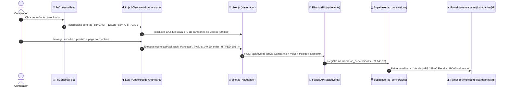

# FéAds — Documentação Técnica, Métricas & Arquitetura de Conversão

> **FéConecta** — Plataforma de Anúncios Patrocinados, Métricas de Desempenho, Gráficos Interativos, FéConecta Pixel & Conversions API (CAPI)

---

## 1. Visão Geral
O **FéAds** é o ecossistema oficial de publicidade nativa e patrocínios da rede social FéConecta. Ele permite que igrejas, editoras, artistas, mentores e empresas cristãs promovam seus livros, conferências, louvores, cursos e produtos diretamente na timeline dos fiéis, com foco total em **resultados mensuráveis, transparência e ROI comprovado**.

---

## 2. Estrutura de Navegação & Painéis Administrativos (`AdsAdmin`)

### A) Barra de Navegação Unificada:
* 🏛️ **`Admin`:** Retorno ao painel geral do sistema FéConecta.
* 🛡️ **`AdsAdmin`:** Módulo executivo de anúncios e moderação.
* 📋 **`Moderação` (`/ads`):** Fila de aprovação e reprovação de campanhas patrocinadas.
* 💳 **`Reembolso` (`/ads/carteira`):** Gestão e estorno de saldos solicitados via Mercado Pago.
* 📊 **`Desempenho` (`/ads/desempenho`):** Visão consolidada de todas as campanhas da rede em tempo real.
* 🧾 **`Extrato` (`/ads/pagamentos`):** Auditoria paginada de recargas, débitos e estornos.
* 👤 **`Painel Usuario` (`/campanha`):** Visão e portal do anunciante/parceiro.

---

## 3. Matriz de Objetivos de Campanha & Otimização de Entrega
O FéAds estrutura as campanhas com base no **resultado que o anunciante quer obter**, e o algoritmo otimiza a distribuição para essa ação específica:

| Objetivo | O que o FéConecta busca | Conversão Principal | Modelo de Cobrança |
| :--- | :--- | :--- | :---: |
| **👁️ Reconhecimento** | Mostrar para o maior número de pessoas | Impressão / Alcance único | **CPM** (R$ 0,01 / visualização) |
| **🔗 Tráfego** | Levar pessoas para um site, página ou link | Clique no Link / Site | **CPC** (R$ 0,25 / clique) |
| **❤️ Engajamento** | Fazer pessoas interagirem no feed | Curtida (fogo), comentários, partilha | **CPM** (R$ 0,01 / visualização) |
| **💬 Contatos** | Gerar contato direto no WhatsApp / chat | Mensagem no WhatsApp / Ligação | **CPC** (R$ 0,50 / clique qualificado) |
| **🎯 Conversões** | Gerar uma ação de negócio (compra / lead) | Compra / Cadastro / Formulário | **CPC** (R$ 0,50 / clique qualificado) |
| **📱 Instalações** | Conseguir novos usuários para o app | Instalação do aplicativo | **CPC** (R$ 0,50 / clique qualificado) |
| **📅 Eventos** | Divulgar congressos e cultos especiais | Inscrição confirmada no evento | **CPC** (R$ 0,50 / clique qualificado) |

---

## 4. Ações de Conversão Personalizadas
Cada anunciante define **qual é o seu resultado final desejado**, permitindo que o painel calcule o Custo por Ação (CPA) correto:
* 📞 **WhatsApp (`whatsapp`):** Contato iniciado no WhatsApp (`wa.me/...`)
* 🛒 **Compra (`compra`):** Compra ou checkout realizado
* 📝 **Cadastro (`cadastro`):** Formulário ou lead preenchido
* 🔗 **Link Externo (`link_externo`):** Visita qualificada na página de destino
* 📅 **Evento (`inscricao_evento`):** Inscrição confirmada no congresso/culto
* ⛪ **Igreja (`visita_igreja`):** Pedido de visita ou informações pastorais
* 📱 **App (`instalacao_app`):** Instalação ou registro no aplicativo
* ❤️ **Engajamento Social (`engajamento_social`):** Curtida com fogo ou comentário na timeline

---

## 5. Fluxo de Criação em 6 Passos (`/campanha/nova`)
1. **Passo 1 — Escolha o Objetivo:** Seleção visual com foco no resultado desejado.
2. **Passo 2 — Defina o Público:** Segmentação por região geográfica, denominações cristãs e interesses.
3. **Passo 3 — Defina Orçamento & Projeção de Metas:** Cálculo em tempo real de estimativa de conversões (ex: *R$ 500 = ~110 a 200 mensagens*).
4. **Passo 4 — Crie o Anúncio:** Nome, formato (Feed, Stories, Banner), upload com compressão automática WebP 1080px, copy persuasiva e botão CTA.
5. **Passo 5 — Defina a Conversão:** Vinculação da ação de sucesso para cálculo de CPA.
6. **Passo 6 — Otimização Algorítmica:** O FéConecta direciona a exibição para membros com maior propensão de converter.

---

## 6. Cálculo e Regras de Cobrança de Valores
A cobrança é **100% pré-paga e controlada pelo motor de tracking atômico**:

### A) Modelo CPM (Custo por Mil Impressões) — Para *Reconhecimento* e *Engajamento*:
* **Custo:** **R$ 0,01** por visualização no feed (1 centavo).
* **Fórmula do CPM:**
  $$\text{CPM} = \left( \frac{\text{Gasto Total (R\$)}}{\text{Total de Impressões}} \right) \times 1.000 = \text{R\$} 10,00 \text{ por mil visualizações}$$
* **Cliques no link:** São **100% gratuitos**.

### B) Modelo CPC (Custo por Clique) — Para *Tráfego*, *Contatos*, *Conversões*, *Eventos*, *Apps*:
* **Custo:** **R$ 0,25 a R$ 0,50** por clique legítimo no CTA/link.
* **Impressões no feed:** São **100% gratuitas** (R$ 0,00 por exibição).
* **Fórmula do CPC:**
  $$\text{CPC} = \frac{\text{Gasto Total (R\$)}}{\text{Total de Cliques}}$$

### C) Trava de Orçamento Automática:
* O PostgreSQL executa `increment_campaign_gasto_atomic`. Assim que $\text{Gasto} \ge \text{Orçamento}$, a campanha é encerrada no mesmo milissegundo. **O anunciante nunca gasta mais do que aprovou.**

### D) Proteção Anti-Fraude (Rate Limit):
* Cliques repetidos em menos de 5 minutos do mesmo IP ou usuário são detectados como suspeitos e **descartados da cobrança**.

---

## 7. FéConecta Pixel & Conversions API (CAPI) — Como Funciona a Atribuição de Vendas



### Passo a Passo de Funcionamento:

1. **No Clique (Passagem de Parâmetros):**
   O anúncio no feed direciona o usuário com parâmetros de rastreamento:
   `https://sualoja.com.br/produto?fc_cid=CAMP_123&fc_pid=FC-8F72A91&utm_source=feconecta&utm_medium=feads`

2. **Na Memória do Navegador (First-Party Cookie de 30 Dias):**
   O script `pixel.js` grava `_fc_cid` e `_fc_pid` no cookie e no `localStorage`. Mesmo se o cliente comprar dias depois, a venda é atribuída à campanha.

3. **No Checkout / Página de Obrigado (Disparo do Evento):**
   ```html
   <!-- Instalação no <head> -->
   <script src="https://ads.feconecta.com.br/pixel.js" data-pixel-id="FC-8F72A91"></script>

   <script>
     // Disparo na confirmação de pagamento
     feconectaPixel.track("Purchase", {
       value: 149.90,        // Valor em Reais
       currency: "BRL",
       order_id: "PED-12345" // ID do Pedido
     });
   </script>
   ```

4. **Conversions API (CAPI via Webhook Server-to-Server):**
   Para plataformas como **Hotmart, Kiwify, Eduzz, Shopify e WooCommerce**:
   * **Endpoint:** `POST https://ads.feconecta.com.br/api/events`
   * **Payload JSON:**
   ```json
   {
     "pixel_id": "FC-8F72A91",
     "campaign_id": "CAMP_123",
     "event_name": "Purchase",
     "value": 149.90,
     "currency": "BRL",
     "order_id": "PED-12345"
   }
   ```

---

## 8. Painel de Desempenho do Anunciante & Gráficos Interativos (`/campanha/[id]`)

### A) Hero Indicator (Resultado Real da Campanha)
* *Exemplo Tráfego:* 🎯 **Resultado da Campanha: `3.240 Cliques no Link`** *(R$ 0,25 por clique)*
* *Exemplo Contatos:* 🎯 **Resultado da Campanha: `186 Contatos no WhatsApp`** *(R$ 2,68 por contato)*
* *Exemplo Compras:* 🎯 **Resultado da Campanha: `25 Compras Realizadas`** *(Receita: R$ 3.747,50 | ROAS: 7,49x)*

### B) Cards Clicáveis com Comparação Multi-Séries
Ao clicar em qualquer um dos 6 cards de métricas, ele alterna a exibição da sua respectiva curva no gráfico:
* 🟢 **Impressões:** Curva contínua verde esmeralda (`#10b981`).
* 🔵 **Alcance:** Curva tracejada azul ciano (`#06b6d4`), visível perfeitamente mesmo quando os números são idênticos aos de impressões.
* 🟣 **Cliques:** Curva roxa (`#a855f7`) escalada na proporção exata do volume do funil.
* 🌸 **CTR (%):** Curva rosa (`#ec4899`) com escala percentual de 0 a 100%.
* 🟡 **Gasto Diário:** Curva dourada (`#f59e0b`) com escala monetária em Reais.
* 🟢 **Conversões:** Curva verde neon (`#22c55e`) com contagem exata de ações reais.

### C) Seletor de Janela Temporal
Abas rápidas de visualização: **`7 Dias`**, **`14 Dias`**, **`30 Dias`** e **`Todo o Período`**.

### D) Tooltip Inteligente com Âncora Anti-Corte
O card flutuante ajusta sua posição horizontal automaticamente de acordo com o quadrante da tela:
* **Dias à direita (ex: 29/08):** O card abre para a esquerda (`translate(-108%, -15%)`), evitando qualquer corte na borda da tela.
* **Dias à esquerda:** O card abre para a direita (`translate(8%, -15%)`).
* **Visualização Completa:** Exibe ponto colorido, nome da métrica e valor numérico/monetário detalhado para cada série selecionada.

---

## 9. Gestão de Carteira & Reembolso
* **Recarga Instantânea:** Pix (QR Code) e Cartão via Mercado Pago.
* **Devolução Automática:** Ao encerrar uma campanha antes do término, o saldo não consumido retorna imediatamente para `saldo_disponivel`.
* **Garantia de Moderação:** Campanhas reprovadas não debitam saldo da carteira.
* **Acesso Protegido à Documentação:** A rota `/docs` possui barreira de login para assegurar privacidade e controle institucional aos membros e parceiros.
